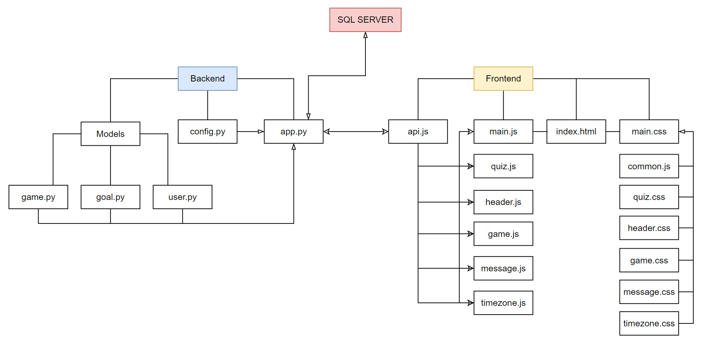
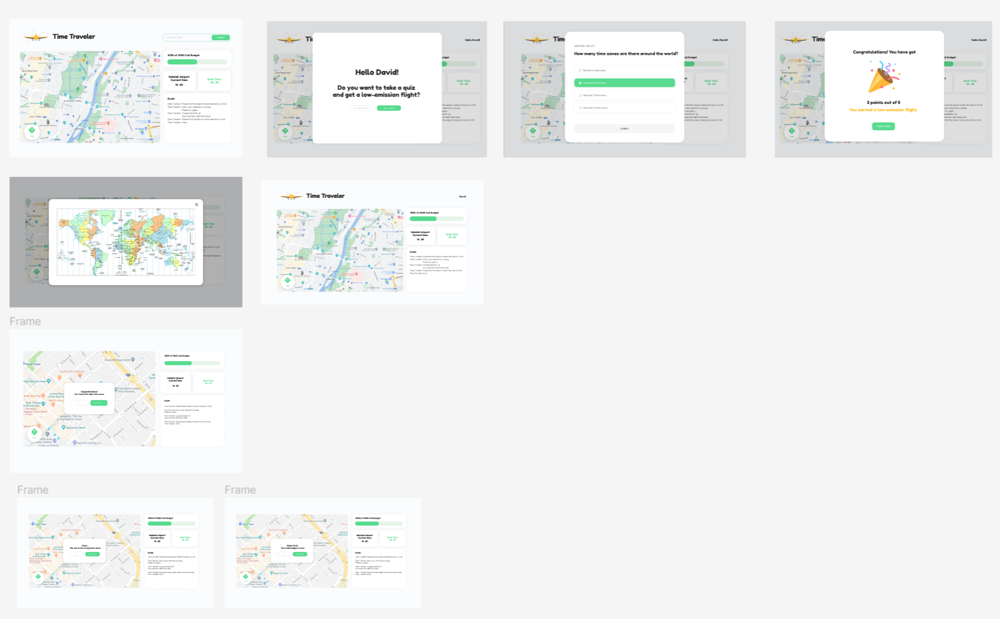

# Time Traveler

Time Traveler is a game. A user is given a time as a goal. The user's task is to find the airport where has the same time as the goal.

## 📌 1. Purpose

The game was created to help students get concrete ideas about the time zone system and geographical locations of cities around the world through visualization.

## 🏗️ 2. Architecture

<p align="center">
  
</p>

### 2.2 Backend

- `app.py`: The file has endpoints to handle http requests sent from the frontend.
- `game.py`, `user.py`, `goal.py`: Game, User, and Goal classes are located into the corresponding file. Classes contain logics and variables to handle backend data.
- `config.py`: Default data to start the game

### 2.3 Frontend

- `api.js`: All functions to send HTTP requests are located.
- `main.js`: Connected to `index.html`. This is the place where all javascript files are called.
- `header.js`: Mainly logics to handles the username submission.
- `quiz.js`: The file have logics related to display and run quiz.
- `game.js`: This file contains functions to set up the frontend and run the game.
- `message.js`: It has codes to display a success, failure, and game over message.
- `timezone.js`: All codes to display and close the timezone modal are located.
- `main.css`: All `.css` files are called in this file.
- `common.css`: Main fonts and colors are stored.
- `quiz.css`, `header.css`, `game.css`, `message.css`, `timezone.css`: Styles related to the certain UI are located.

- Frontend: JavaScript, CSS, HTML
- Backend: Python, Flask
- Server: SQL, MySQL
- Design: Figma, AdobeXD

## ⚙️ 3. How to run locally

### 3.1 Prerequisite to run the project

- Add `.env`
  In the backend, you should create `.env` file.
  Please add the following lines of codes in the `.env` file.

```
HOST='YOUR HOST ex) 127.0.0.1'
DB_PORT = 'PORT WHERE THE DB IS RUNNING ON'
DB_NAME='ex)flight_game'
DB_USER='USER NAME ex)root'
DB_PASS='YOUR PASSWORD'
```

- Create DB
  Do you have airport and country table? Run `setup > game_table.sql` in HeidiSQL.
  Need to set up all tables? Run `setup > flightgame.sql` in HeidiSQL.

### 3.2 Run the back-end and the front-end

- Backend: run `app.py`
- Frontend: run `index.html` in the localhost `http://127.0.0.1:5500/`

## 4. 🧰 Technology

| Category | Technology            |
| -------- | --------------------- |
| FrontEnd | JavaScript, HTML, CSS |
| BackEnd  | Python, Flask         |
| Database | SQL, MySQL            |
| DESIGN   | Figma                 |

## 🎨 5. UI

<p align="center">
  
</p>
